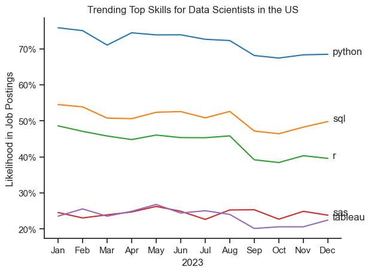
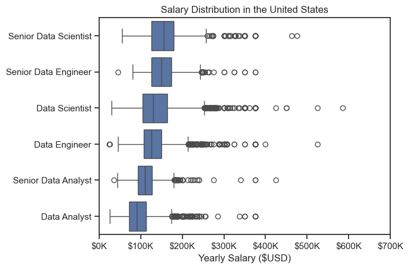
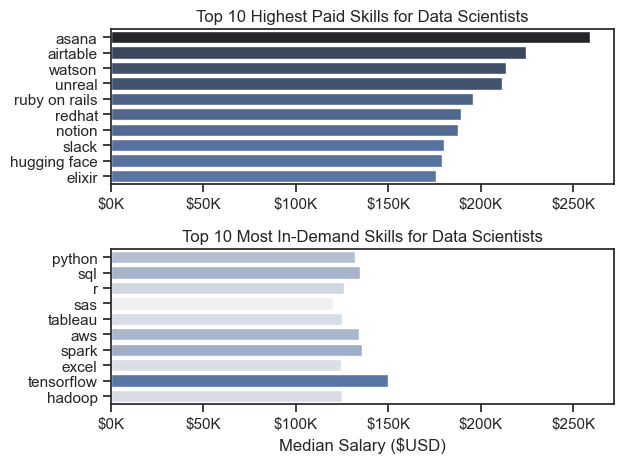
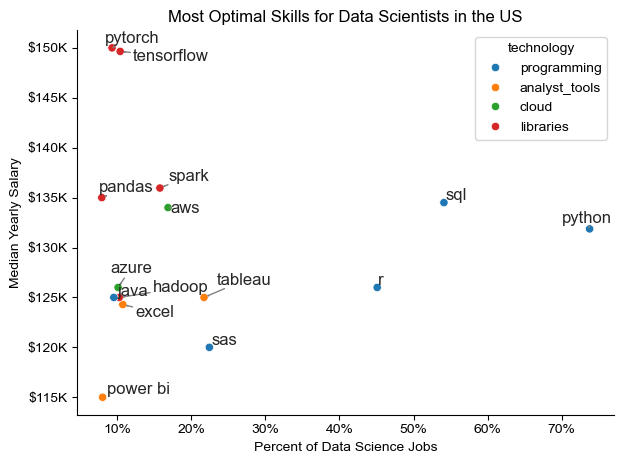

# The Analysis

## 1. What are the most demanded skills for the top 3 most popular data roles?

To find the most demanded skills for the top 3 most popular data roles, I filtered out those positions by which ones were the most popular, and got the top 5 skills for these top 3 roles. This query highlights the most popular job titles and their top skills, showing which skills I should pay attention to depending on the role I'm targeting.

View my notebook with detailed steps here: [2_Skills_Count.ipynb](3_Project/2_Skills_Count.ipynb)

### Visualize Data

```python
fig, ax = plt.subplots(len(job_titles), 1)

for i, job_title in enumerate(job_titles):
    df_plot = df_skills_percent[df_skills_percent['job_title_short'] == job_title].head(5)
    sns.barplot(data=df_plot, x='skill_percent', y='job_skills', ax=ax[i], hue='skill_count', palette='dark:b_r')
    ax[i].set_title(job_title)
    ax[i].set_ylabel('')
    ax[i].set_xlabel('')
    ax[i].get_legend().remove()
    ax[i].set_xlim(0, 78)

plt.show()
```

### Results


### Insights

- Python is a versatile skill, highly demanded across all three roles, but most prominently for Data Scientists (72%) and Data Engineers (65%). 
- SQL is the most requested skill for Data Analysts and Data Scientists, with it in over half the job postings for both roles. For Data Engineers, Python is the most sought after skill, appearing in 68% of job postings.
- Data Engineers require more specialized technical skills (AWS, Azure, Spark) compared to Data Analysts and Data Scientists who are expected to be proficient in more general data management and analysis tools (Excel, Tableau)

# The Analysis

## 2. How are in-demand skills trending for Data Scientists?

To reveal which technical skills are gaining or fading among U.S. Data Scientist postings, I filtered the dataset to Data Scientist roles in the United States and converted each job’s skills into a list. I then exploded those lists to count how often each skill appears per month, reordered the skill columns by their overall frequency, and normalized monthly counts by the total number of Data Scientist postings to get a percentage-of-listings measure. Finally, I plotted the top five skills by overall frequency as monthly trend lines, which highlights not just the most common skills but how their demand shifts month-to-month across 2023.

View my notebook with detailed steps here: [3_Skill_Trend.ipynb](3_Project/3_Skill_Trend.ipynb)

### Visualize Data

```python

from matplotlib.ticker import PercentFormatter

df_plot = df_DS_US_percent.iloc[:, :5]
sns.lineplot(data=df_plot, dashes=False, legend='full', palette='tab10')

plt.gca().yaxis.set_major_formatter(PercentFormatter)
plt.show()
```

### Results

 *Bar graph visualizing the trending top skills for data scientists in the US in 2023*

### Insights

- Python continues to dominate the data science landscape, appearing in over 70% of job postings. This consistency highlights its role as the core programming language for analytics, modeling, and machine learning across industries. Its stability suggests that Python is no longer a “preferred” skill but rather it’s an expected baseline for data scientists.
- SQL remains an essential complement, second only to Python, reflecting how data scientists are still deeply involved in data extraction, cleaning, and querying tasks. The steady demand shows that practical database knowledge remains crucial even in an era of advanced AI tools.
- R’s moderate but declining presence indicates a gradual shift away from traditional statistical environments toward more unified, Python-based ecosystems. However, its continued use suggests niche applications in research, academia, and specialized analytics where R’s statistical libraries excel.
- SAS and Tableau occupy smaller, stable portions of the skill market. SAS maintains relevance in legacy enterprise systems and regulated sectors (like finance or healthcare), while Tableau’s steady demand reflects ongoing emphasis on data visualization and communication but, newer tools like Power BI may be influencing its slower growth.

# The Analysis

## 3. How well do jobs and skills pay for Data Scientists?

To understand how compensation varies across data jobs and skills, I began by filtering U.S. job postings that include annual salary data. From there, I identified the six most common data-related job titles and compared their salary distributions using boxplots ordered by median pay which allowed me to see which roles tend to offer the highest compensation.
Next, I narrowed the focus to Data Scientist roles and exploded each job’s list of skills to calculate both the median salary per skill and the count of postings mentioning each skill. This allowed me to identify which skills are most lucrative versus which are most frequently demanded.
Finally, I visualized the top 10 highest-paying skills and the top 10 most in-demand skills side by side using bar charts. Together, these plots highlight the contrast between skill popularity and pay potential, showing which technical skills not only appear most often in job listings but also command the strongest salaries among Data Scientists in the U.S.

View my notebook with detailed steps here: [4_Salary_Analysis.ipynb](3_Project/4_Salary_Analysis.ipynb)

### Salary Analysis

### Visualize Data

#### Results

*Box plot visualizing the salary distribution for the top 6 data job titles*

#### Insights

- There's a significant variation in salary ranges across different job titles. Senior Data Scientist positions tend to have the highest salary potential, with up to $600K, indicating the high value placed on advanced data skills and experience in the industry.

- Senior Data Engineer and Senior Data Scientist roles show a considerable number of outliers on the higher end of the salary spectrum, suggesting that exceptional skills or circumstances can lead to high pay in these roles. In contrast, Data Analyst roles demonstrate more consistency in salary, with fewer outliers.

- The median salaries increase with the seniority and specialization of the roles. Senior roles (Senior Data Scientists, Senior Data Engineer) not only have higher median salaries but also larger differences in typical salaries, reflecting greater variance in compensation as responsibilities increase. 

# The Analysis

## 3. How well do jobs and skills pay for Data Scientists

### Highest Paid & Most Demanded Skills for Data Scientists

#### Visualize Data

```python
fig, ax = plt.subplots(2, 1)

# Top 10 Highest Paid Skills for Data Scientists
sns.barplot(data=df_DS_top_pay, x='median', y=df_DS_top_pay.index, ax=ax[0], hue='median', palette='dark:b_r')
ax[0].legend().remove()

# Top 10 Most in Demand Skills for Data Scientists
sns.barplot(data=df_DS_skills, x='median', y=df_DS_skills.index, ax=ax[1], hue='median', palette='light:b')
ax[1].legend().remove()

plt.show()
```

#### Results 


*Two separate bar graphs visualizing the highest paid skills and most in demand skills for data scientists in the US.*

#### Insights:

- High-paying skills like Asana, Airtable, Watson, and Unreal offer salaries exceeding $200K, but are niche or less common in typical data science roles, showing that rarity drives compensation.
- Tools such as Ruby on Rails, RedHat, and Hugging Face suggest a growing value for software engineering and AI model deployment expertise within data science.
- In contrast, most in-demand skills (Python, SQL, R, SAS, Tableau) align with core data manipulation and analysis, reflecting what employers consistently require.
- These foundational tools are widely used but lower paid, indicating market saturation: high supply of professionals keeps salaries moderate.
- TensorFlow, Spark, and Hadoop bridge both lists slightly, showing how machine learning and big data engineering remain lucrative hybrid skill areas.
- Overall, the charts reveal a trade-off between specialization and demand, generalist skills ensure employability, while specialized or emerging technologies command premium pay.

# The Analysis

## 4. What is the most optimal skill to learn for Data Scientists?

To identify the most optimal skills for Data Scientists in the U.S. like those that balance strong salary potential with widespread demand; I filtered postings for Data Scientist roles with reported yearly salaries and expanded each job’s skill list. I then calculated each skill’s median salary and its occurrence percentage across all Data Scientist listings.
After isolating the skills appearing in more than 7% of postings, I plotted skill demand (percent of jobs) against median salary, labeling each point to visualize which skills offer both high pay and high relevance. This scatterplot reveals where learning a skill provides the greatest career leverage skills positioned toward the upper right are both lucrative and in-demand.
Finally, I extended the analysis by linking each skill to its associated technology category. This second visualization adds color-coded groupings to highlight which technology domains dominate among the top-performing skills, helping pinpoint not only which individual skills are most valuable but also which categories of tools are shaping the Data Science landscape

View my notebook with detailed steps here: [5_Optimal_Skills.ipynb](3_Project/5_Optimal_Skills.ipynb)

#### Visualize Data

```python
from adjustText import adjust_Text
import matplotlib.pyplot as plt

plt.scatter(df_DS_skill_high_demand['skill_percent'], df_DS_skills_high_demand['median_salary'])
plt.show()

```

#### Results

*A scatter plot visualizing the most optimal skills (high paying & high demand for data scientists in the US).*

#### Insights: 

- Python and SQL dominate demand appearing in most data science roles, but offer moderate median salaries, reflecting their ubiquity and essential nature.
- PyTorch and TensorFlow stand out as high salary, low demand skills, indicating strong pay premiums for deep learning specialization.
- Analyst and cloud tools (e.g., Tableau, Power BI, AWS, Azure) occupy the middle ground, showing balanced job presence and solid pay, valuable for well rounded professionals.